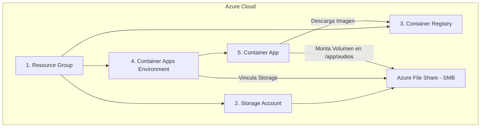

# Guía Completa de Replicación en Azure: Implementación de RadioStreaming en Contenedores

Esta guía proporciona instrucciones detalladas y extensas para replicar toda la infraestructura y el despliegue del proyecto **RadioStreaming** en un entorno de Azure completamente nuevo y diferente. Cubre la creación de recursos, la configuración de almacenamiento compartido por SMB (Azure File Share), la compilación y publicación de imágenes con Azure Container Registry (ACR), y la orquestación e integración con Azure Container Apps (ACA).

---

## 🏗️ Arquitectura de Recursos en Azure

Para desplegar este sistema, se requieren y configuran los siguientes 5 recursos principales de Azure:



1. **Grupo de Recursos (Resource Group):** Contenedor lógico que agrupa todos los servicios de esta solución para facilitar su administración y facturación.
2. **Cuenta de Almacenamiento (Storage Account) y File Share:** Sistema de archivos persistente compartido por protocolo SMB/FileREST. Permite que el contenedor guarde los archivos `.wav` de manera persistente fuera de la vida útil del contenedor.
3. **Registro de Contenedores de Azure (ACR):** Repositorio privado y seguro para almacenar y gestionar imágenes Docker.
4. **Entorno de Container Apps (ACA Environment):** Límite seguro alrededor de una o más Container Apps que comparten la misma red virtual y escriben en el mismo almacenamiento.
5. **Aplicación de Container App:** El recurso de cómputo serverless donde corre nuestro contenedor que graba las radios.

---

## 🚀 Paso 1: Configurar Variables del Entorno de Terminal

Antes de ejecutar los comandos, define las variables en tu terminal bash para que puedas copiar y pegar los comandos tal cual, modificándolas solo una vez.

```bash
# Nombre del nuevo grupo de recursos que se creará
export RESOURCE_GROUP="mi_nuevo_rg_equilibrium"

# Región de Azure (ej: eastus, westus2, centralus)
export LOCATION="westus2"

# Nombre único global para el nuevo Storage Account (letras minúsculas y números únicamente, 3-24 caracteres)
export STORAGE_ACCOUNT="radionewstore"

# Nombre del recurso File Share (SMB)
export FILE_SHARE_NAME="radiofileshare"

# Nombre único global para el Azure Container Registry (ACR)
export ACR_NAME="radionewregistry"

# Nombre para el Entorno de Azure Container Apps
export ACA_ENV_NAME="radionewenv"

# Nombre de la aplicación de Container App
export ACA_APP_NAME="radiostreamingapp"
```

---

## 🛠️ Paso 2: Creación de la Infraestructura en Azure (Paso a Paso)

### 1. Iniciar Sesión en Azure CLI
Autentica tu terminal de comandos con tu cuenta de Azure:
```bash
az login
```
* **Explicación:** Abre una pestaña del navegador para iniciar sesión de forma segura. Si tienes múltiples suscripciones, puedes seleccionarla usando `az account set --subscription <ID_SUSCRIPCION>`.

### 2. Crear el Grupo de Recursos
```bash
az group create --name $RESOURCE_GROUP --location $LOCATION
```
* **Explicación:** 
  * `--name`: Especifica el nombre de tu grupo de recursos.
  * `--location`: La región física del datacenter de Azure donde residirán tus metadatos y servicios.

### 3. Crear la Cuenta de Almacenamiento (Storage Account)
```bash
az storage account create \
  --name $STORAGE_ACCOUNT \
  --resource-group $RESOURCE_GROUP \
  --location $LOCATION \
  --sku Standard_LRS \
  --kind StorageV2
```
* **Explicación:**
  * `--sku Standard_LRS`: Utiliza almacenamiento estándar con Redundancia Local (LRS), que copia tus datos tres veces dentro del mismo datacenter para tener un costo óptimo y alta disponibilidad.
  * `--kind StorageV2`: Cuenta de propósito general de última generación que soporta Blob, Archivos (Shares), Colas y Tablas.

### 4. Crear el Recurso de File Share (Almacenamiento SMB)
```bash
az storage share create \
  --name $FILE_SHARE_NAME \
  --account-name $STORAGE_ACCOUNT
```
* **Explicación:** Crea el directorio compartido SMB con el nombre especificado dentro de la cuenta de almacenamiento recién creada. Este volumen persistirá todos los audios generados.

### 5. Crear el Azure Container Registry (ACR)
```bash
az acr create \
  --resource-group $RESOURCE_GROUP \
  --name $ACR_NAME \
  --sku Basic \
  --admin-enabled true
```
* **Explicación:**
  * `--sku Basic`: Un plan de bajo costo ideal para desarrollo e implementaciones medianas.
  * `--admin-enabled true`: Habilita las credenciales del usuario administrador para permitir que Azure Container Apps pueda autenticarse contra el registro utilizando usuario y contraseña (útil para despliegues rápidos).

### 6. Crear el Entorno de Azure Container Apps (ACA Environment)
```bash
az containerapp env create \
  --name $ACA_ENV_NAME \
  --resource-group $RESOURCE_GROUP \
  --location $LOCATION
```
* **Explicación:** Provisiona la infraestructura de red subyacente y el plano de control compartido para tus contenedores.

---

## 🐳 Paso 3: Compilar y Publicar la Imagen Docker

Una vez que la infraestructura básica existe, debemos enviar nuestra aplicación al registro privado en la nube (`ACR`).

### 1. Iniciar Sesión en tu Nuevo Registro ACR
```bash
az acr login --name $ACR_NAME
```
* **Explicación:** Configura de manera segura las credenciales locales de Docker para autorizar el empuje (`push`) de imágenes hacia el nuevo ACR.

### 2. Compilar la Imagen Localmente (Si no se ha hecho)
Asegúrate de estar en el directorio raíz del proyecto donde están `Dockerfile` y `start.sh`, luego compila:
```bash
docker build -t radiostreamingeq:latest .
```
* **Explicación:** Compila el archivo `Dockerfile` instalando `ffmpeg`, `procps` y las dependencias de `requirements.txt`, asignándole el tag local `radiostreamingeq:latest`.

### 3. Etiquetar la Imagen para ACR
```bash
docker tag radiostreamingeq:latest ${ACR_NAME}.azurecr.io/streamingreqimg:latest
```
* **Explicación:** Crea un alias (tag) que le dice al motor de Docker que esta imagen pertenece al host del registro privado de Azure (`${ACR_NAME}.azurecr.io`).

### 4. Empujar la Imagen a la Nube (ACR)
```bash
docker push ${ACR_NAME}.azurecr.io/streamingreqimg:latest
```
* **Explicación:** Transfiere físicamente las capas de la imagen Docker desde tu máquina local hacia el registro ACR seguro en la nube.

---

## 🔗 Paso 4: Conectar y Montar el File Share en el Entorno ACA

Este es el paso crítico de conexión. Debemos autorizar al Entorno de Container Apps a acceder a la Cuenta de Almacenamiento usando llaves de acceso, y exponerlo como una montura lógica.

### 1. Obtener la Clave Secreta del Storage Account
```bash
STORAGE_KEY=$(az storage account keys list \
  --resource-group $RESOURCE_GROUP \
  --account-name $STORAGE_ACCOUNT \
  --query "[0].value" \
  --output tsv)
```
* **Explicación:**
  * `az storage account keys list`: Obtiene las dos llaves maestras de acceso del Storage Account.
  * `--query "[0].value"`: Filtra mediante query de JMESPath para obtener únicamente el string de la primera llave.
  * `--output tsv`: Remueve comillas y saltos de línea para guardar el valor limpio en la variable `$STORAGE_KEY`.

### 2. Registrar el Storage en el Entorno de Container Apps (Vincular SMB)
```bash
az containerapp env storage set \
  --name $ACA_ENV_NAME \
  --resource-group $RESOURCE_GROUP \
  --storage-name smbradios \
  --azure-file-account-name $STORAGE_ACCOUNT \
  --azure-file-account-key "$STORAGE_KEY" \
  --azure-file-share-name $FILE_SHARE_NAME \
  --access-mode ReadWrite
```
* **Explicación:**
  * `--storage-name smbradios`: **Muy importante!** Este es el nombre lógico de montaje que Container Apps le da al almacenamiento. Debe coincidir exactamente con el valor `storageName: smbradios` definido en tu archivo YAML.
  * `--azure-file-share-name`: El File Share SMB real creado anteriormente en el paso 2.4.
  * `--access-mode ReadWrite`: Permite permisos de lectura y escritura para que Python pueda guardar y modificar los archivos de audio.

---

## 📄 Paso 5: Modificar y Aplicar el Archivo YAML

### 1. Actualizar `containerapp.yaml` con el Nuevo ACR
Abre tu archivo `containerapp.yaml` y asegúrate de que el campo `image` apunte al nuevo registro de contenedores. Debe quedar estructurado de la siguiente forma:

```yaml
properties:
  template:
    containers:
      - name: radio
        image: <REMPLAZAR_POR_TU_NUEVO_ACR>.azurecr.io/streamingreqimg:latest
        volumeMounts:
          - volumeName: volcontainerapp
            mountPath: /app/audios
    volumes:
      - name: volcontainerapp
        storageType: AzureFile
        storageName: smbradios
```

* **Explicación de las propiedades de montaje del YAML:**
  * `volumeMounts.volumeName`: Nombre de la referencia lógica del volumen que se inyecta en el contenedor (`volcontainerapp`).
  * `volumeMounts.mountPath`: El directorio físico **dentro** del contenedor Linux en el que se montará la unidad (`/app/audios`). Todos los archivos grabados en Python en la ruta `audios/` se escribirán físicamente aquí.
  * `volumes.name`: Declara el volumen (`volcontainerapp`).
  * `volumes.storageType`: Define que es del tipo `AzureFile` (SMB).
  * `volumes.storageName`: El nombre lógico que configuramos en el comando `az containerapp env storage set` (`smbradios`).

### 2. Crear la Aplicación de Container App usando el YAML
Ejecuta el siguiente comando para desplegar y arrancar la aplicación por primera vez en tu nuevo entorno:

```bash
az containerapp create \
  --name $ACA_APP_NAME \
  --resource-group $RESOURCE_GROUP \
  --environment $ACA_ENV_NAME \
  --yaml containerapp.yaml
```
* **Explicación:** Este comando lee las configuraciones declarativas del archivo `containerapp.yaml`, descarga la imagen desde tu ACR, inicializa el volumen SMB montándolo en `/app/audios`, abre el puerto del contenedor y levanta los servicios.

---

## 🔍 Paso 6: Comandos de Monitoreo y Verificación

Una vez ejecutados los pasos anteriores, utiliza estos comandos para validar el estado del despliegue:

### 1. Ver los Logs en Tiempo Real del Contenedor
```bash
az containerapp logs show \
  --name $ACA_APP_NAME \
  --resource-group $RESOURCE_GROUP \
  --follow
```
* **Uso:** Te permite ver de inmediato si la aplicación de Python inicializó correctamente, si escribió el archivo de prueba en el File Share, y los avisos de inicio del ciclo de grabaciones.

### 2. Listar Archivos en el File Share SMB Remoto
Valida directamente en el almacenamiento de Azure que los archivos `.wav` y las carpetas por lugar se estén creando correctamente:
```bash
az storage file list \
  --account-name $STORAGE_ACCOUNT \
  --share-name $FILE_SHARE_NAME \
  --account-key "$STORAGE_KEY" \
  --output table
```
Para ver subcarpetas específicas (ej: `radio_stream/esmeraldas`):
```bash
az storage file list \
  --account-name $STORAGE_ACCOUNT \
  --share-name $FILE_SHARE_NAME \
  --path "radio_stream/esmeraldas" \
  --account-key "$STORAGE_KEY" \
  --output table
```

---
*Guía de replicación elaborada por Antigravity.*
